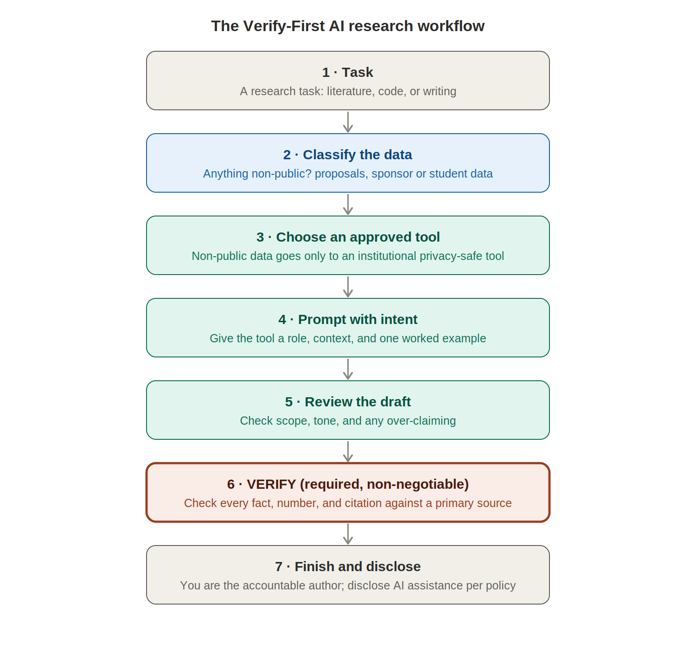

# Verify-First
### A Responsible-AI Research Productivity Clinic for Graduate Researchers

**Liang Zhang, Ph.D.** — Assistant Professor, Civil & Architectural Engineering and Mechanics, University of Arizona · Director, TensorBuild Lab · Joint appointee, National Renewable Energy Laboratory (NREL)

**Capstone Project — University of Arizona AI Campus Champions Program (Summer 2026)** · June 2026

---

## Executive summary

Graduate researchers across engineering already use general-purpose AI tools such as ChatGPT, Claude, and Gemini to help with literature reviews, coding, and writing. They do this on their own, without shared rules, which creates two quiet but serious risks: AI systems can state fabricated facts and citations with complete confidence, and researchers can inadvertently paste confidential material — unpublished proposals, sponsor data, or student records — into tools that were never approved for it.

**Verify-First** is a small, practical initiative that teaches graduate researchers a disciplined way to use AI: a workflow in which the human always stays the accountable author, every factual claim is checked against a real source, and sensitive data never leaves approved, privacy-protected tools. It is delivered as a three-session clinic for a pilot group of graduate students, using the University's own privacy-safe AI platforms so that no student needs to buy a subscription or expose confidential work.

The goal is not to police AI or to promote it, but to replace ad-hoc, invisible use with a shared, safe, and teachable practice — and to make that practice durable enough to outlive the clinic itself.

> *This initiative was developed as the capstone of the University of Arizona AI Campus Champions program (Summer 2026) and integrates that program's six-week methodology on responsible and effective AI use.*

---

## 1. Background: why this initiative, and why now

### 1.1 The reality on the ground

Generative AI is already embedded in graduate research. Students use it to summarize papers, draft and debug code, tighten prose, and brainstorm. This is not hypothetical and it is not going away. The practical question for a research group is therefore not *whether* AI will be used, but whether it will be used *well* — safely, accountably, and with an understanding of where it fails.

Right now, most of that use is invisible and improvised. There is no shared standard for what is acceptable, no common understanding of the failure modes, and no norm for protecting confidential data. That gap is where harm happens.

### 1.2 What actually goes wrong

Four failure modes matter most in a research setting. Each is explained here in plain terms, because understanding *why* AI fails is what makes the safeguards make sense.

**Fabricated facts ("hallucination").** A large language model does not look up answers in a database; it generates text by predicting the most likely next words based on patterns in its training data. This is why it is fluent — and also why it can state things that are simply untrue, including invented statistics, fake citations, and non-existent references, all delivered in the same confident tone as correct information (Ji et al., 2023). In testing for this project, a model asked to summarize a research topic inserted the claim that "buildings use 60% of energy." The real figure is closer to 40%. Nothing in the output signaled that the number was invented; only checking it against a source revealed the error.

**The "jagged frontier."** AI capability is uneven in ways that do not match human intuition. A system can be excellent at one task and quietly wrong at a very similar one, and you cannot tell which from how confident the output sounds (Dell'Acqua et al., 2023). The danger is over-reliance: fluent, authoritative output lowers the reader's guard exactly when scrutiny is most needed.

**Data exposure.** Pasting text into a consumer AI tool can send that text to an external company, where it may be retained or used to improve future models. For a researcher, that can mean leaking an unpublished proposal, confidential sponsor or occupant data, a manuscript under peer review, or protected student records — a serious confidentiality and, in the case of student records, legal (FERPA) problem.

**Bias and representation.** Because these systems are trained on large amounts of internet text, they reproduce the patterns in that text (Bender et al., 2021). Asked to name "leading researchers" in a field or to generate example lists, they tend to over-represent dominant demographics, which can subtly shape whose work students see as central.

### 1.3 The gap this initiative fills

The University of Arizona provides privacy-protected AI tools and clear guidance on academic integrity and data handling. What is missing is guidance aimed at **research** rather than coursework, and a **shared verification norm** inside research groups. Verify-First fills exactly that gap: it turns "protect your data and check your facts" from good advice into a concrete, teachable workflow.

---

## 2. The Verify-First initiative

### 2.1 The core idea: a workflow, not a rule

The heart of the initiative is a single workflow that a researcher runs every time they use AI. It divides the work cleanly: the AI drafts and accelerates, and the human owns judgment, accuracy, and accountability. This division is deliberate — it keeps human control at exactly the point where AI errors are most damaging.

The workflow makes two safeguards mandatory rather than optional. **Step 2 (classify the data)** ensures confidential material never reaches a non-approved tool. **Step 6 (verify)** ensures no AI-produced fact, number, or citation enters a deliverable without being checked against a primary source. Everything else is guidance; these two are non-negotiable.

### 2.2 Who this is for

The primary audience is master's and doctoral researchers in engineering who already use AI informally but have not developed a systematic, safe approach. Most are moderately fluent — comfortable typing a prompt into a chatbot, but unaware of the failure modes above or of the privacy-safe institutional tools available to them. Their real need is a concrete workflow that saves time without risking their integrity or their data. Their most common worry is a fair one: *"Will using AI look like cheating, or hurt my credibility as a scholar — and is my data even safe?"* Verify-First answers that worry directly.

### 2.3 Tools and approach

The initiative relies exclusively on tools the University already provides at no cost, so that participation requires no purchase and no exposure of confidential data:

| Tool | Best use | Data it may touch |
|---|---|---|
| Institutional privacy-safe AI platform (university-hosted access to major models) | Reasoning, drafting, summarizing, analysis | Cleared for internal and research (non-public) material |
| University document-grounded research assistant | Summarizing and querying uploaded papers and reports | Public or already-licensed documents |
| Enterprise code assistant (verify departmental license) | Writing and refactoring analysis code | Non-proprietary code only |
| Locally run transcription (on-device) | Transcribing meetings and interviews | Kept entirely on the researcher's own machine |

The guiding principle is simple: **public information can go to any approved tool; anything non-public goes only to an institutional, privacy-protected tool.**

### 2.4 Ethical safeguards

| Risk | Safeguard | Who owns it |
|---|---|---|
| Fabricated facts or citations in a manuscript or proposal | Mandatory verification: every claim, number, and citation checked against a primary source before it enters any deliverable | Each researcher, with advisor sign-off |
| Confidential data leaking to an external tool | Data-classification rule: non-public material goes only to institutional privacy-safe tools, never consumer apps | Group lead (owner of the guideline) |
| Under-representation / bias in AI-generated lists or exemplars | Cross-check AI-suggested "key work" and "leaders" against independent, diverse sources | Clinic facilitator |
| Over-reliance and loss of skill in junior researchers | Keep the human as author and decision-maker; explicitly teach *when not* to use AI | Advisors |

### 2.5 Equity considerations

The design deliberately protects two groups who could otherwise be disadvantaged:

- **International and multilingual researchers**, who may lean on AI for English and could be unfairly judged for it, or may fear that disclosing AI use will be held against them. Verify-First frames AI as legitimate language support, adopts disclosure norms that do not penalize non-native writers, and teaches verification so that this reliance is safe rather than risky.
- **Researchers without paid tools or personal devices.** The clinic assumes neither. It routes all work through free institutional tools and runs in a department computer lab, so no one needs a subscription or a personal laptop to participate.

---

## 3. The clinic: a three-session design

The initiative is delivered as three short, hands-on sessions. Each ends with a concrete artifact the participant keeps.

**Session 1 — Safe by default.** What AI actually is and how it fails; the data-classification rule; a live tour of the University's privacy-safe tools. *Takeaway:* participants classify their own current AI use and identify anything they should stop doing today.

**Session 2 — Verify-First.** The verification discipline in practice: spotting fabricated facts and citations, checking numbers against sources, and recognizing the "jagged frontier" where confident output is wrong. Participants run a guided exercise on a deliberately flawed AI output. *Takeaway:* a personal verification checklist.

**Session 3 — In the workflow.** Applying the workflow to real research tasks — literature synthesis, coding, and drafting — using effective prompting, and deciding when *not* to use AI. *Takeaway:* each participant leaves with a written personal AI workflow for their own research.

---

## 4. Ninety-day action plan

**Days 1–30 — Prepare (independent).** Draft the three-session outline and turn it into participant handouts (the quick-reference card and advisor checklist in the appendices). Identify a pilot group of six to eight researchers from my own lab and one collaborating lab.
*Collaborator:* Megan Letchworth, Graduate Program Coordinator, who knows which students to reach.
*Barrier and response:* the risk is over-scoping into a whole-department program; the response is to cap the pilot at eight participants and one partner lab.

**Days 31–60 — Launch (collaborative).** Meet a co-sponsoring faculty colleague to pressure-test the design, confirm a room and schedule, invite participants, and run Session 1 with a short pre-survey.
*Collaborator:* Dominic Boccelli, senior faculty colleague, as co-sponsor.
*Barrier and response:* low sign-up from busy students; the response is to frame the clinic around a concrete pain point (time spent on literature reviews and proposals) and to hold it during an existing lab-meeting slot rather than adding a new obligation.

**Days 61–90 — Deliver and document.** Run Sessions 2 and 3, collect the post-survey, and write a short "what worked / what broke" brief so the materials can be reused and shared.
*Barrier and response:* the practice decays once the clinic ends; the response is described in Section 5.
*By day 90:* a piloted, documented clinic for up to eight researchers, with before/after evidence of improved verification behavior and safer tool use, and a reusable brief.

---

## 5. Sustaining it: the human layer

The hardest part of any adoption effort is not teaching a skill; it is making the skill stick after the training ends. A workflow can be taught in an afternoon, but changing what a busy lab does by default takes sustained reinforcement that no single workshop can supply.

Verify-First addresses this in two ways. First, it moves the norm out of the clinic and into the lab by giving **each advisor a one-page checklist** (Appendix B) — so the verification habit is reinforced by the person the student works with every week, not just by a facilitator they saw three times. Second, it treats the materials as a shared resource that other groups can adopt and adapt, so the practice can spread laterally between labs rather than depending on one person.

---

## 6. Success metrics

| Metric | How it is measured | Minimum target |
|---|---|---|
| Verification behavior | Pre/post exercise: can participants catch a fabricated claim and check it against a source? | ≥ 70% demonstrate verification afterward |
| Safe tool use | Pre/post survey of which tools participants use for sensitive data | ≥ 80% route non-public data only through approved tools |
| Real-world adoption | 30-day follow-up: did they apply the workflow to actual work? | ≥ 60% report real use |

---

## Appendix A — Quick reference for researchers (Verify-First card)

**Three rules, every time:**

1. **You are the author.** AI drafts; you are accountable for every word that goes out under your name.
2. **Verify everything specific.** Check every fact, number, quotation, and citation against a primary source — not against the AI's own restatement of it.
3. **Protect the data.** Never put anything non-public (unpublished proposals, manuscripts under review, sponsor or occupant data, student records) into a consumer AI tool. Use an institutional privacy-safe tool instead.

**Which tool for which data:**

| If the material is… | Use… |
|---|---|
| Public (published papers, public web text) | Any approved tool |
| Non-public (unpublished, confidential, personal) | An institutional privacy-safe tool only |
| Protected student records | An approved tool only, and de-identify first |

**Before anything leaves your hands, ask:**

- [ ] Did I check every fact, number, and citation against a real source?
- [ ] Did any confidential data go only to an approved tool?
- [ ] Would I stand behind this if asked, as its author?
- [ ] Have I disclosed AI assistance where the venue or policy requires it?

**When *not* to use AI:** when you cannot verify the output, when the data is confidential and no approved tool is available, or when the task is one you are still learning and need to build the skill yourself.

---

## Appendix B — One-page checklist for advisors

**Why this matters for your lab:** AI can genuinely speed up literature work, coding, and drafting — but it also fabricates facts and citations, and it can leak confidential data. A single unchecked number or invented reference in a proposal or paper is a credibility risk that lands on the whole group.

**The one norm to reinforce:** *verify before it ships.* Your researchers should treat every AI-produced fact, number, and citation as unverified until checked against a primary source.

**A 30-second check before a student's draft goes out:**

- [ ] Ask: "Which of these facts and citations did you verify against the original source?"
- [ ] Spot-check one or two specific numbers or references yourself.
- [ ] Confirm no confidential data went into a non-approved tool.

**How to make it stick:** name the expectation explicitly in your group, model it on your own drafts, and treat "I verified this" as a normal, expected part of handing work in.

---

## Appendix C — Data classification at a glance

| Data type | Examples | Rule |
|---|---|---|
| Public | Published papers, public datasets, public web text | Any approved tool |
| Internal / research (non-public) | Unpublished proposals, drafts, sponsor and occupant data | Institutional privacy-safe tool only |
| Confidential — peer review | Manuscripts you are reviewing | No external tool at all |
| Protected personal | Student records, personnel data | Approved tool only; de-identify first; follow FERPA |

---

## References

- Bender, E. M., Gebru, T., McMillan-Major, A., & Shmitchell, S. (2021). On the dangers of stochastic parrots: Can language models be too big? *FAccT.*
- Dell'Acqua, F., et al. (2023). Navigating the jagged technological frontier. *Harvard Business School Working Paper 24-013.*
- Ji, Z., et al. (2023). Survey of hallucination in natural language generation. *ACM Computing Surveys, 55*(12).
- National Institute of Standards and Technology (2023). *AI Risk Management Framework (AI RMF 1.0).*
